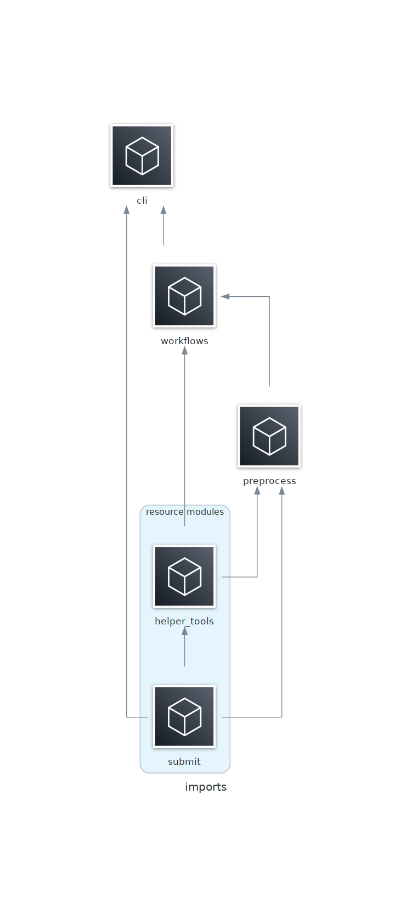

# func_preprocess
This package conducts pre-processing for functional MRI data, and is used for both Exp2_Compute_Emotion and Exp3_Classify_Archival datasets.

Contents:
- [Setup](#setup)
- [Testing](#testing)
- [Usage](#usage)
- [Functionality](#functionality)
- [Notes](#notes)
- [Diagrams](#diagrams)


## Setup
- Install into project environment on the Duke Compute Cluster (DCC; see [here](https://github.com/labarlab/conda_dcc)) via `$python setup.py install`.
- Singularity images are required for AFNI and fMRIPrep
- FreeSurfer and FSL need to be configured and executable from the shell
- Generate an RSA key for labarserv2 and set the global variable `RSA_LS2` to hold the key path.
- Required global variables:
    - `SING_AFNI`: singularity image of AFNI
    - `SING_FMRIPREP`: singularity image of fMRIPrep
    - `SINGULARITYENV_TEMPLATEFLOW_HOME`: location of templateflow
    - `FS_LICENSE`: location of FreeSurfer license
    - `FSLDIR`: location of FSL binaries
    - `RSA_LS2`: location of RSA key for labarserv2


## Testing
- Planned unit and integration tests are available at `tests/run_tests.py` and executable via `$cd tests; python run_tests.py`.
- ***Note:*** testing is only supported on a scheduled node of the DCC with 5 CPUs and 24 GB RAM: `$srun --cpus-per-task 5 --mem 24G --pty bash -i`.


## Usage
Trigger package help and usage via entrypoint `$func_preprocess`

```
(emorep)[nmm51-dcc: ~]$func_preprocess
usage: func_preprocess [-h] [--fd-thresh FD_THRESH] [--ignore-fmaps] [--proj-dir PROJ_DIR] [--sess {ses-day2,ses-day3} [{ses-day2,ses-day3} ...]] -s SUBJ [SUBJ ...]

Version : 2.5.0

Conduct preprocessing for EmoRep.

Download required data from Keoki, preprocess EPI data via FreeSurfer,
fMRIPrep, and extra FSL and AFNI steps. Generates scaled and smoothed
EPI output. Upload files to Keoki. Sessions are treated independently
for FreeSurfer and fMRIPrep.

The workflow writes files to <work_dir>, and when finished purges
some intermediates and saves final files to <proj_dir>.
Specifically, final files are saved to:
    <proj-dir>/derivatives/pre_processing/[fmriprep|freesurfer|fsl_denoise]

Log files and scripts are generated for review and troubleshooting,
and written to:
    <work_dir>/logs/func_preprocess_<timestamp>

Notes
-----
- AFNI and fMRIPrep are executed from singularity, FSL and
    FreeSurfer from a subprocess call.

- Requires the following environmental global variables:
    -   SING_AFNI = path to AFNI singularity
    -   SING_FMRIPREP = path to fMRIPrep singularity
    -   SINGULARITYENV_TEMPLATEFLOW_HOME = path to templateflow for fmriprep
    -   FS_LICENSE = path to FreeSurfer license
    -   FSLDIR = path to FSL binaries
    -   RSA_LS2 = path to RSA key for labarserv2

- FSL should be also be configured in the environment.

- Long file paths can result in a buffer overflow of FreeSurfer tools!

Examples
--------
func_preprocess -s sub-ER0009
func_preprocess \
    -s sub-ER0009 sub-ER0010 \
    --sess ses-day2 \
    --fd-thresh 0.2 \
    --ignore-fmaps

optional arguments:
  -h, --help            show this help message and exit
  --fd-thresh FD_THRESH
                        Framewise displacement threshold
                        (default : 0.5)
  --ignore-fmaps        Whether fmriprep will ignore fmaps
  --proj-dir PROJ_DIR   Path to BIDS-formatted project directory
                        (default : /hpc/group/labarlab/EmoRep/Exp2_Compute_Emotion/data_scanner_BIDS)
  --sess {ses-day2,ses-day3} [{ses-day2,ses-day3} ...]
                        List of session IDs to submit for pre-processing
                        (default : ['ses-day2', 'ses-day3'])

Required Arguments:
  -s SUBJ [SUBJ ...], --subj SUBJ [SUBJ ...]
                        List of subject IDs to submit for pre-processing

```

The workflow for processing EmoRep and Archival data utilize the default options (first example), with other options supplied for flexibility.


## Functionality
Generally, the steps to the pre-processing workflow are:

1. Download data from Keoki to DCC
1. Pre-run FreeSurfer
1. Run fMRIPrep
1. Conduct extra pre-processing steps:
    1. Bandpass filter
    1. Scaling
    1. (optional) Smoothing
    1. Mask data
1. Upload data to Keoki and clean up DCC

`func_preprocess` runs parallel workflows for each participant's session. Output is saved in a derivatives/pre_processing directory:

```bash
derivatives/pre_processing/
├── fmriprep
│   ├── sub-ER0009
│   ├── sub-ER0009_ses-day2.html
│   ..
│   ├── sub-ER9999
│   └── sub-ER9999_ses-day2.html
├── freesurfer
│   └── ses-day2
│      ├── sub-ER0009
│      ..
│      └── sub-ER9999
└── fsl_denoise
    ├── sub-ER0009
    ..
    └── sub-ER9999
```

Where fmriprep and fsl_denoise are BIDS-organized, but freesurfer inverts the session and subject organization. The fmriprep and freesurfer directories are organized according to the defaults of those software suites, and fsl_denoise employs the BIDS organization with an added `desc-scaled|smoothed` field.

Also, see [Diagrams](#diagrams).


## Notes
- Data are downloaded from Keoki to the DCC location /hpc/group/labarlab/EmoRep
- Processing occurs in /work/user/EmoRep, and final files are sent to /hpc/group/labarlab/EmoRep/derivatives/pre_processing.
- Logs are written to /work/user/EmoRep/logs, as are the python scripts for the parent jobs. Stdout/err for parent jobs are captured in par0009.txt, and stdout/err for child jobs are captured in subj_sess_desc.txt e.g. 0009_day2_fmriprep.txt
- If the default `--sess-list` is used, data from both session are required and the entire workflow will fail if one session fails or is missing. Specify the existing session when only session exists or rerunning a specific session e.g. `--sess-list ses-day2`
- Long file paths can result in buffer overflow errors for FreeSurfer!


## Diagrams
Diagram of processes, showing workflow as a function of package methods. Additionally, parent and child processes are illustrated, as well as which steps are multi-processed.


Diagram of imports.

