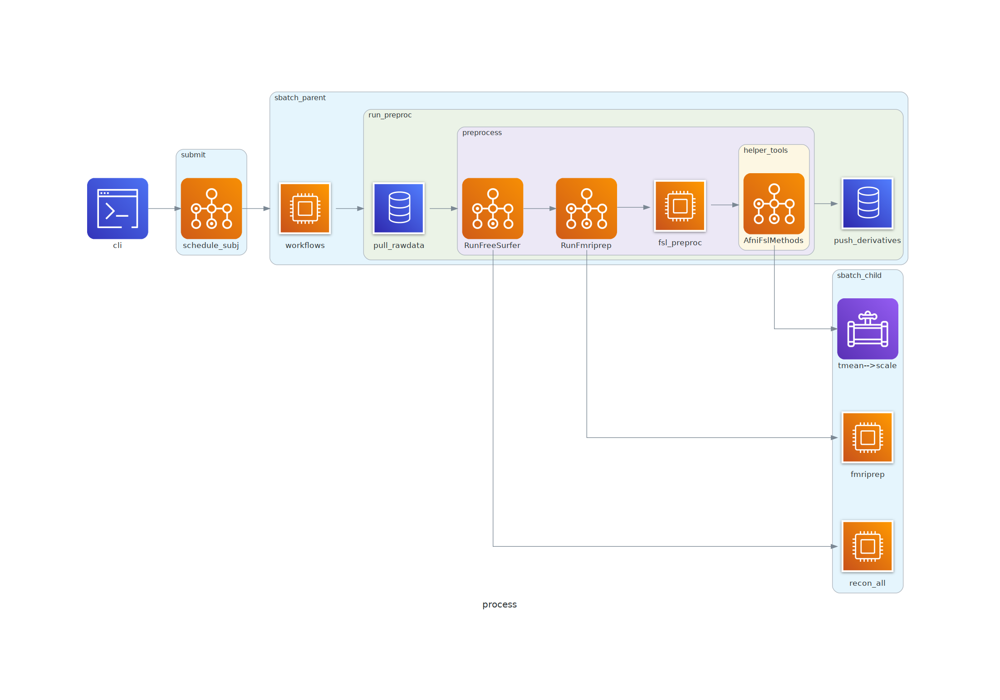

# func_preprocess
This package conducts pre-processing for functional MRI data, and is used for both Exp2_Compute_Emotion and Exp3_Classify_Archival datasets.

Contents:
- [Setup](#setup)
- [Usage](#usage)
- [Functionality](#functionality)
- [Notes](#notes)
- [Diagrams](#diagrams)


## Setup
- Install into project environment on the Duke Compute Cluster (DCC; see [here](https://github.com/labarlab/conda_dcc)) via `$ python setup.py install`.
- Singularity images are required for AFNI and fMRIPrep, and FreeSurfer and FSL should be configured in the environment.
- Required global variables:
    - `SING_AFNI`: singularity image of AFNI
    - `SING_FMRIPREP`: singularity image of fMRIPrep
    - `SINGULARITYENV_TEMPLATEFLOW_HOME`: location of templateflow
    - `FS_LICENSE`: location of FreeSurfer license
    - `FSLDIR`: location of FSL binaries


## Usage
Trigger package help and usage via entrypoint `$ func_preprocess`

```
(emorep)[nmm51-dcc: ~]$func_preprocess
usage: func_preprocess [-h] [--fd-thresh FD_THRESH] [--ignore-fmaps] [--proj-dir PROJ_DIR] [--rsa-key RSA_KEY]
                       [--run-local] [--ses-list SES_LIST [SES_LIST ...]] [--work-dir WORK_DIR] -s SUB_LIST
                       [SUB_LIST ...]

Version : 2.4.0

Conduct preprocessing for EmoRep.

Download required data from Keoki, preprocess EPI data via FreeSurfer,
fMRIPrep, and extra FSL and AFNI steps. Generates scaled and smoothed
EPI output. Upload files to Keoki. Sessions are treated independently
for FreeSurfer and fMRIPrep.

The workflow writes files to <work_dir>, and when finished purges
some intermediates and saves final files to <proj_dir>.
Specifically, final files are saved to:
    <proj-dir>/derivatives/pre_processing/[fmriprep|freesurfer|fsl_denoise]

Log files and scripts are generated for review and troubleshooting,
and written to:
    <work_dir>/logs/func_preprocess_<timestamp>

Notes
-----
- AFNI and fMRIPrep are executed from singularity, FSL and
    FreeSurfer from a subprocess call.

- Requires the following environmental global variables:
    -   SING_AFNI = path to AFNI singularity
    -   SING_FMRIPREP = path to fMRIPrep singularity
    -   SINGULARITYENV_TEMPLATEFLOW_HOME = path to templateflow for fmriprep
    -   FS_LICENSE = path to FreeSurfer license
    -   FSLDIR = path to FSL binaries

- FSL should be also be configured in the environment.

- When running remotely, parent job "p<subj>" is submitted for each subject
    that controls the workflow. Named subprocesses "<subj>foo" are spawned
    when additional resources are required.

Examples
--------
func_preprocess -s sub-ER0009 --rsa-key $RSA_LS2

func_preprocess \
    -s sub-ER0009 sub-ER0010 \
    --ses-list ses-day2 \
    --rsa-key $RSA_LS2 \
    --fd-thresh 0.2 \
    --ignore-fmaps

projDir=/mnt/keoki/experiments2/EmoRep/Exp2_Compute_Emotion/data_scanner_BIDS
workDir=${projDir}/derivatives/pre_processing
func_preprocess \
    --run-local \
    --proj-dir $projDir \
    --work-dir $workDir \
    -s sub-ER0009 sub-ER0016

optional arguments:
  -h, --help            show this help message and exit
  --fd-thresh FD_THRESH
                        Framewise displacement threshold
                        (default : 0.5)
  --ignore-fmaps        Whether fmriprep will ignore fmaps,
                        True if "--ignore-fmaps" else False.
  --proj-dir PROJ_DIR   Required when --run-local.
                        Path to BIDS-formatted project directory
                        (default : /hpc/group/labarlab/EmoRep/Exp2_Compute_Emotion/data_scanner_BIDS)
  --rsa-key RSA_KEY     Required on DCC; location of labarserv2 RSA key
  --run-local           Run pipeline locally on labarserv2 rather than on
                        default DCC.
                        True if "--run-local" else False.
  --ses-list SES_LIST [SES_LIST ...]
                        List of session IDs to submit for pre-processing
                        (default : ['ses-day2', 'ses-day3'])
  --work-dir WORK_DIR   Required when --run-local.
                        Path to derivatives location on work partition, for processing
                        intermediates. If None, the work-dir will setup in
                        /work/<user>/EmoRep/derivatives. Be mindful of path lengths
                        to avoid a buffer overflow in FreeSurfer.
                        (default : None)

Required Arguments:
  -s SUB_LIST [SUB_LIST ...], --sub-list SUB_LIST [SUB_LIST ...]
                        List of subject IDs to submit for pre-processing

```

The workflow used for processing Exp2 and Exp3 data utilize the default options (first example), with other options supplied for usability.


## Functionality
`func_preprocess` runs parallel workflows for each session of a participant's `rawdata`, generating output into the structure:

```bash
derivatives/pre_processing/
├── fmriprep
│   ├── sub-ER0009
|   ..
│   └── sub-ER1137
├── freesurfer
│   ├── ses-day2
|   |   ├── sub-ER0009
|   |   ..
│   |   └── sub-ER1137
│   └── ses-day3
|       ├── sub-ER0009
|       ..
│       └── sub-ER1137
└── fsl_denoise
    ├── sub-ER0009
    ..
    └── sub-ER1137
```

The `fmriprep` and `fsl_denoise` output directories are BIDS-organized, but the `freesurfer` organization inverts subject and session.

Generally, the steps to the pre-processing workflow are:

1. Download data from Keoki to DCC
1. Pre-run FreeSurfer
1. Run fMRIPrep
1. Conduct extra pre-processing steps:
    1. Bandpass filter
    1. Scaling
    1. (optional) Smoothing
    1. Mask data
1. Upload data to Keoki and clean up DCC

Also, see [Diagrams](#diagrams).

The first and last steps are omitted if run locally (but FreeSurfer and fMRIPrep have not be recently tested on labarserv2).

## Notes
- Data are downloaded from Keoki to `/hpc/group/labarlab/EmoRep`
- Processing occurs in `/work/<user>/EmoRep`, and final files are sent to `/hpc/group/labarlab/EmoRep/derivatives/pre_processing`.
- Logs are written to `/work/<user>/EmoRep/logs`, as are the python scripts for the parent jobs. Stdout/err for parent jobs are captured in `par0009.txt`, and stdout/err for child jobs are captured in `subj_sess_desc.txt` e.g. `0009_day2_fmriprep.txt`
- If the default `--sess-list` is used, data from both session are required and the entire workflow will fail if one session fails or is missing. Specify the existing session when only session exists or rerunning a specific session e.g. `--sess-list ses-day2`

## Diagrams
Diagram of processes, showing workflow as a function of package methods. Additionally, parent and child processes are illustrated, as well as which steps are multi-processed.


Diagram of imports.

